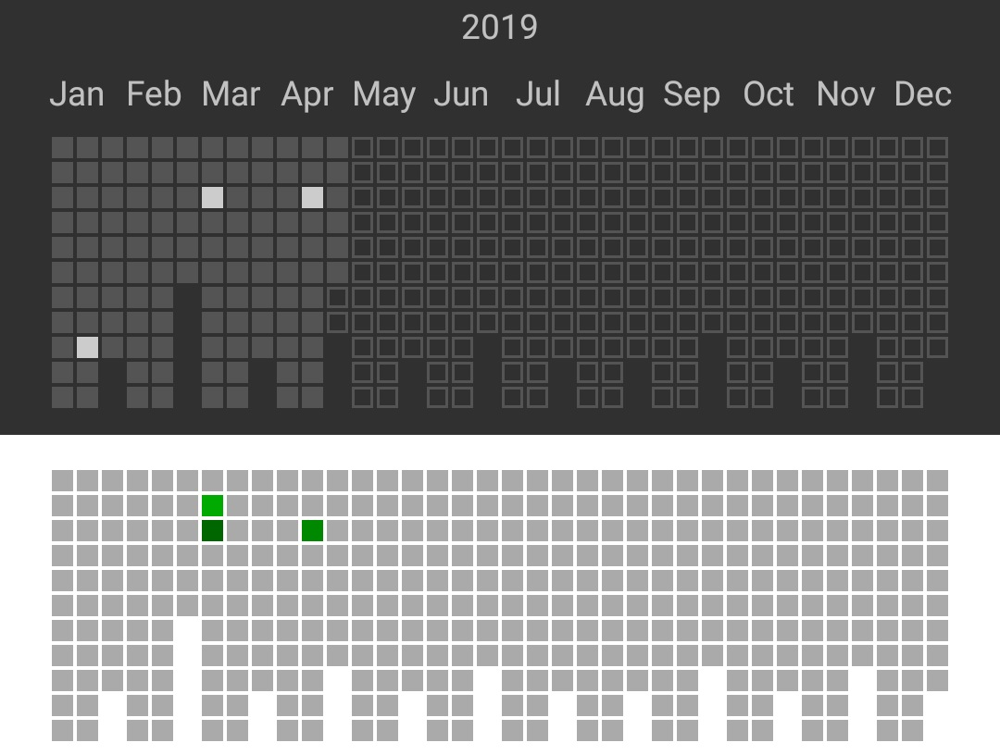

### Tiles


An Android view displaying github-like progress tiles.

##### Important:

1. This library requires API 14 (Android 4.0) or greater to run.
2. This library depends on Joda Time for org.joda.time.LocalDate, but you have the option to use java.time.LocalDate if the minimal SDK of your application is 26 (Android 8.0) or greater.

##### Example of use:

1. Add TilesView to your layout's xml file:
```xml
<com.sengami.tiles.TilesView
            android:id="@+id/tiles_view"
            android:layout_width="match_parent"
            android:layout_height="wrap_content" />
```

2. Create your TileDecorator implementation, where you will set the look of your cells depending on their date and number associated with them:
```java
public class SampleTileDecorator implements TileDecorator {
    
    private final Context context;

    public SampleTileDecorator(final Context context) {
        this.context = context;
    }

    @Override
    public void decoratePastCell(final View view, final int number) {
        // You can do anything here, for example set a background drawable or color.
        view.setBackgroundResource(R.drawable.some_drawable);
        view.setBackgroundColor(ContextCompat.getColor(context, R.color.zero_entries));
    }

    @Override
    public void decorateTodayCell(final View view, final int number) {
        // ...
    }

    @Override
    public void decorateFutureCell(final View view, final int number) {
        // ...
    }
}
```

3. Configure the TilesView:
```java
final TilesView tilesView = findViewById(R.id.tiles_view);
final TilesViewConfiguration configuration = new TilesViewConfiguration.Builder()
    .tileDecorator(new SampleTileDecorator(context)) // required - determines the style of tiles, add your implementation here
    .year(2019) // optional but HIGHLY recommended - used calculate leap year, will default to 2000
    .daysPerColumn(11) // optional - will default to 11
    .columnsPerMonth(3) // optional - will default to 3
    .build();
tilesView.configure(configuration);
```

4. Display data:
```java
tilesView.display(sampleData()); // Map<java.time.LocalDate, Integer>
// or
tilesView.displayCompat(sampleDataCompat()); // Map<org.joda.time.LocalDate, Integer>
```

5. You might encounter these exceptions if you do not configure properly:
```
NotEnoughColumnsPerMonthOrDaysPerColumnException - [daysPerColumn] multiplied by [columnsPerMonth] is less than 31.

TileDecoratorNotSetInTilesViewConfigurationException - [tileDecorator] was not set in the TilesViewConfiguration.

TileViewConfigurationNotSetInTilesViewException - [configuration] was not set in TilesView before calling display() / displayCompat().
``` 